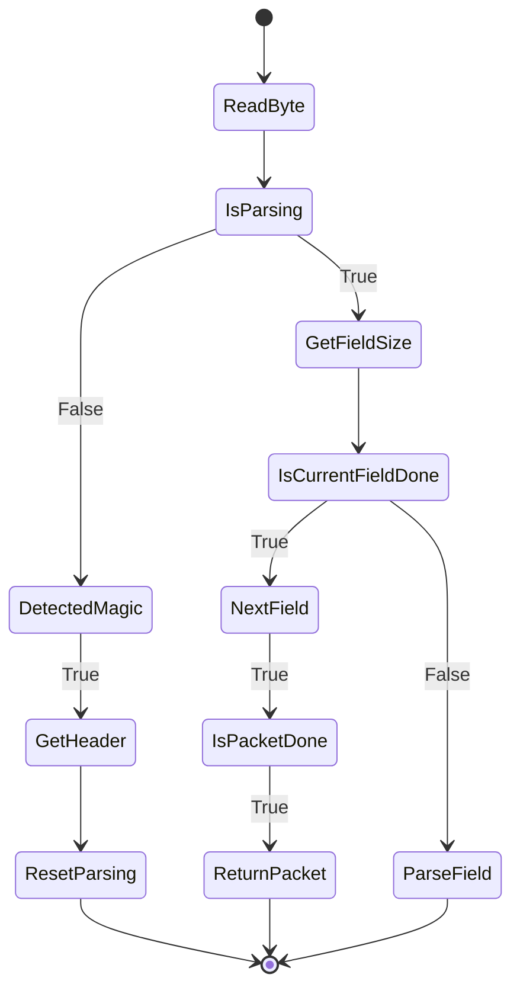

```mermaid
stateDiagram-v2
    [*] --> ReadByte
    ReadByte --> IsParsing
    IsParsing --> DetectedMagic: False
    DetectedMagic --> GetHeader: True
    GetHeader --> ResetParsing
    ResetParsing --> [*]
    IsParsing --> GetFieldSize: True
    GetFieldSize --> IsCurrentFieldDone
    IsCurrentFieldDone --> NextField: True
    NextField --> IsPacketDone: True
    IsPacketDone --> ReturnPacket : True
    ReturnPacket --> [*]
    IsCurrentFieldDone --> ParseField: False
    ParseField --> [*]
```
